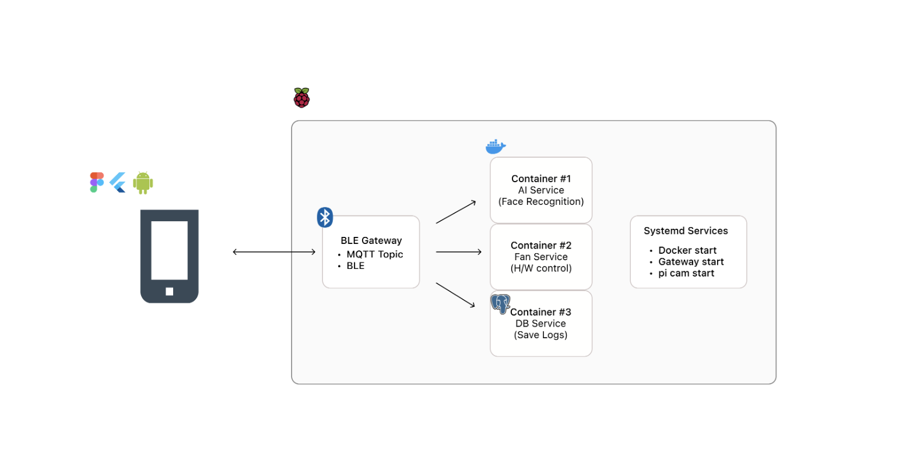
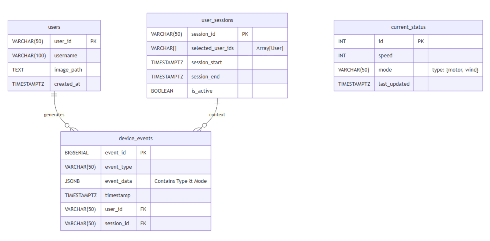
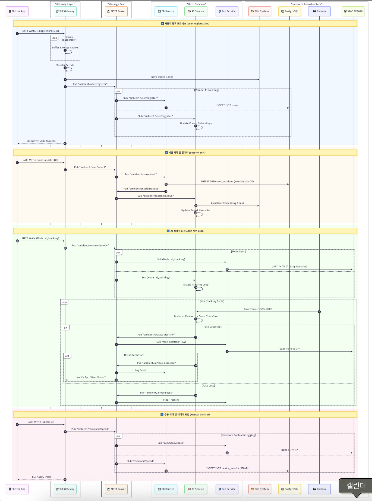

# 소프트웨어학부 캡스톤디자인

**🌪️ Ambient Node: AI Smart Air Circulator**

**AI 비전 기반 사용자 추적형 스마트 에어서큘레이터**

> **2025-2 캡스톤 디자인 프로젝트**
> 
> 
> 🍓 **Platform:** Raspberry Pi 5 (Bookworm 64-bit)
> 
> 🏗️ **Architecture:** MSA (Micro Service Architecture) + BLE Hybrid
> 

---

본 프로젝트는 엣지 디바이스(Raspberry Pi)에서 독립적으로 구동되는 **보안형 AI 가전 소프트웨어 스택**입니다. 클라우드 연결 없이 온디바이스 AI로 사용자를 추적하며, **BLE 프로토콜**을 통해 모바일 앱과 안정적으로 연동됩니다.

**🛠️ Tech Stack**

**Core & Architecture**

[Raspberry Pi](https://camo.githubusercontent.com/1c89535a1bb960508b00c7dadcc7a981b0e962e1eb6f01448e05e4b21fa2046c/68747470733a2f2f696d672e736869656c64732e696f2f62616467652f52617370626572727925323050692d4132323834363f7374796c653d666f722d7468652d6261646765266c6f676f3d7261737062657272797069266c6f676f436f6c6f723d7768697465)

[Docker](https://camo.githubusercontent.com/85e3ff712bb08b8e5595b34ecddfd189a51b20f61988aa467a56c5da9a107dda/68747470733a2f2f696d672e736869656c64732e696f2f62616467652f446f636b65722d3234393645443f7374796c653d666f722d7468652d6261646765266c6f676f3d646f636b6572266c6f676f436f6c6f723d7768697465)

[Systemd](https://camo.githubusercontent.com/094d105aa14a76c19edc732e3f9a4a9c5d4eea63c58930b7ec44984041a105bf/68747470733a2f2f696d672e736869656c64732e696f2f62616467652f53797374656d642d3233324133383f7374796c653d666f722d7468652d6261646765266c6f676f3d6c696e7578266c6f676f436f6c6f723d7768697465)

**Backend & AI**

[Python](https://camo.githubusercontent.com/324b4cfa68deb1b9c0008c02e910370ae1e1b7141ce0fe77972b6ea034e7abb7/68747470733a2f2f696d672e736869656c64732e696f2f62616467652f507974686f6e2d3337373641423f7374796c653d666f722d7468652d6261646765266c6f676f3d707974686f6e266c6f676f436f6c6f723d7768697465)

[TensorFlow](https://camo.githubusercontent.com/699c02ea0f3d186cbe0da284bb8daed96e4fa2c99fabd1085f9115d0d2767141/68747470733a2f2f696d672e736869656c64732e696f2f62616467652f54656e736f72466c6f772d4646364630303f7374796c653d666f722d7468652d6261646765266c6f676f3d74656e736f72666c6f77266c6f676f436f6c6f723d7768697465)

[OpenCV](https://camo.githubusercontent.com/3fec915016daabcbf832b1a6c8410aedbc57915b3394a597ef14817fdeb559e1/68747470733a2f2f696d672e736869656c64732e696f2f62616467652f4f70656e43562d3543334545383f7374796c653d666f722d7468652d6261646765266c6f676f3d6f70656e6376266c6f676f436f6c6f723d7768697465)

**Database**

[PostgreSQL](https://camo.githubusercontent.com/5d449b9369911768091bbdb3f514c0e2b1dc492b53c13962212c6798848ced34/68747470733a2f2f696d672e736869656c64732e696f2f62616467652f506f737467726553514c2d3431363945313f7374796c653d666f722d7468652d6261646765266c6f676f3d706f737467726573716c266c6f676f436f6c6f723d7768697465)

**Communication**

[Bluetooth](https://camo.githubusercontent.com/8a1f3ebc8e2994188093a12c8226f53560b02fa09f8d266e02d1482e21b04bd2/68747470733a2f2f696d672e736869656c64732e696f2f62616467652f426c7565746f6f74682d3030383246433f7374796c653d666f722d7468652d6261646765266c6f676f3d626c7565746f6f7468266c6f676f436f6c6f723d7768697465)

[MQTT](https://camo.githubusercontent.com/fc3015ffc26f62a7d311944921017ce9bf4ac4d5a49b5cdcbdd9212a80f161ee/68747470733a2f2f696d672e736869656c64732e696f2f62616467652f4d5154542d3636303036363f7374796c653d666f722d7468652d6261646765266c6f676f3d6d717474266c6f676f436f6c6f723d7768697465)

**📂 시스템 아키텍처 (System Architecture)**



**주요 컴포넌트**

1. **Flutter App**: BLE 클라이언트 및 사용자 인터페이스 (UI/UX)
2. **BLE Gateway**: BLE ↔ MQTT 프로토콜 중계 (Python + bluezero)
3. **AI Service**: 얼굴 인식 및 실시간 추적 (FaceNet + MediaPipe)
4. **Fan Service**: XIAO RP2040 통신 (UART)
5. **DB Service**: 데이터 영속성 관리 및 통계 분석 (PostgreSQL)
6. **MQTT Broker**: 서비스 간 메시지 버스 (Mosquitto)

---

**User Context & Session Management**

이 프로젝트는 명시적인 세션 기반(Session-based)으로 사용자 행동을 분석합니다.

앱에서 사용자를 선택하는 시점에 세션이 시작됩니다.

**1. 세션 라이프사이클 (Session Lifecycle)**

- **세션 시작 (Start):** 앱에서 사용자를 선택하면 `ambient/user/select` 이벤트가 발생하며 새로운 `session_id`가 발급됩니다.
- **활성 상태 (Active):** 세션이 유지되는 동안 발생하는 모든 제어(풍속, 회전, 모드)는 해당 `session_id`와 매핑되어 저장됩니다.
- **얼굴 인식 로그:** 세션 중 AI가 사용자를 감지하면 `face_detected` 이벤트를 기록하여, 실제 사용자가 기기 앞에 머문 시간을 추적합니다.
- **세션 종료 (End):** 사용자 선택 해제 시 세션이 닫히며 종료 시간이 기록됩니다.

**2. 다중 사용자 지원**

- `user_sessions` 테이블의 `selected_user_ids` 필드는 **배열(Array)** 형태로, 필요에 따라 여러 명의 사용자를 하나의 세션으로 묶을 수 있도록 설계되었습니다.

---

**📁 프로젝트 구조 (Directory Structure)**

```
/home/pi/ambient-node/
├── docker-compose.yml            # 전체 서비스 오케스트레이션 (AI, DB, Fan, MQTT)
├── Services/
│   ├── ble_gateway.py            # [Host] BLE <-> MQTT 중계 및 이미지 청킹
│   ├── ambient-ble-gateway.service # Systemd: BLE Gateway 자동 실행
│   └── rpicam-stream.service     # Systemd: 카메라 TCP 스트리밍
├── ai-service/                   # [Container] 얼굴 감지/식별 (MediaPipe + TFLite)
├── db-service/                   # [Container] 데이터 저장 및 통계 분석 (PostgreSQL)
├── fan-service/                  # [Container] 모터 제어 및 UART 통신
└── mqtt_broker/                  # [Container] 서비스 간 메시지 버스 (Mosquitto)

/var/lib/ambient-node/            # [Data Volume] 영구 저장소 (Host Mount)
├── users/                        # 사용자 프로필 데이터 (이미지, 임베딩)
│   └── user_12345/
│       ├── embedding.npy         # 얼굴 특징 벡터
│       ├── metadata.json         # 사용자 메타 정보
│       └── user_12345.png        # 프로필 이미지
├── captures/                     # 임시 캡처 이미지
├── db_data/                      # PostgreSQL 데이터 파일
└── mqtt/                         # MQTT 로그 및 데이터
```

---

**설치 및 실행 가이드 (Getting Started)**

**1. 자동 설치 스크립트 실행 (Recommended)**

필요한 시스템 패키지, Python 가상환경, Docker 권한 설정 등을 한 번에 처리합니다.

**./init_setting.sh 수행 내용**

- bluez, libbluetooth-dev 등 필수 패키지 설치
- BLE Gateway용 Python 가상환경(.venv) 생성
- /var/lib/ambient-node 데이터 디렉토리 생성 및 권한 부여

**2. 서비스 실행**

```
# 서비스 파일 등록
sudo cp Services/*.service /etc/systemd/system/
sudo systemctl daemon-reload

# 서비스 시작 및 부팅 시 자동 실행 설정
sudo systemctl enable --now rpicam-stream.service       # 카메라 스트리밍
sudo systemctl enable --now ambient-ble-gateway.service # BLE 게이트웨이
sudo systemctl enable --now ambient-node.service        # Docker Compose (전체 스택)
```

---

**주요 기능 상세 (Technical Highlights)**

각 서비스는 독립적인 컨테이너(또는 프로세스)로 동작하며 MQTT로 통신합니다.

**1. BLE Gateway (Host Process)**

> **역할:** 모바일 앱과 라즈베리파이 간의 통신 관문 (Connection & Protocol Bridge)
> 

[](https://camo.githubusercontent.com/f86361c44594c99e6bc8adce37f8af8623e419c170dfcbd18bffc3544ea154ef/68747470733a2f2f696d672e736869656c64732e696f2f62616467652f507974686f6e2d3337373641423f7374796c653d666c61742d737175617265266c6f676f3d707974686f6e266c6f676f436f6c6f723d7768697465)

[](https://camo.githubusercontent.com/9549199a1cfec6ca2f9d2a8078648d883daca6ef0b0c04548f290baea362062d/68747470733a2f2f696d672e736869656c64732e696f2f62616467652f426c75655a65726f2d3030353243433f7374796c653d666c61742d737175617265266c6f676f3d626c7565746f6f7468266c6f676f436f6c6f723d7768697465)

[](https://camo.githubusercontent.com/8634e0cfeb556699f69a3652314c963d9a68cb4c1308bc2d6a3dda85cb6be834/68747470733a2f2f696d672e736869656c64732e696f2f62616467652f5061686f5f4d5154542d3636303036363f7374796c653d666c61742d737175617265266c6f676f3d65636c69707365266c6f676f436f6c6f723d7768697465)

[](https://camo.githubusercontent.com/5bdfbd9ac385b1e6dae184670198f77e7c0ccafce1078097efaecda048e0b005/68747470733a2f2f696d672e736869656c64732e696f2f62616467652f53797374656d642d3233324133383f7374796c653d666c61742d737175617265266c6f676f3d6c696e7578266c6f676f436f6c6f723d7768697465)

| **기능 (Feature)** | **세부 내용 (Detail)** |
| --- | --- |
| **BLE Peripheral** | Flutter 앱과 GATT 연결 수립, 대용량 데이터(이미지) Chunking 수신 및 조립 |
| **Protocol Bridge** | `BLE Command` ↔ `MQTT Message` 양방향 변환 및 내부망 전파 |
| **Reliability** | JSON 데이터 파싱 검증, 예외 처리, 요청에 대한 **ACK 응답 시스템** 구현 |

**2. AI Service**

> **역할:** 카메라 영상을 분석하여 사용자 신원을 식별하고 위치를 추적 (Vision Intelligence)
> 

[](https://camo.githubusercontent.com/f86361c44594c99e6bc8adce37f8af8623e419c170dfcbd18bffc3544ea154ef/68747470733a2f2f696d672e736869656c64732e696f2f62616467652f507974686f6e2d3337373641423f7374796c653d666c61742d737175617265266c6f676f3d707974686f6e266c6f676f436f6c6f723d7768697465)

[](https://camo.githubusercontent.com/81b8d1a99a1931bbfd38dc61352c90aae89a0ca5848668030da55f6880c5f867/68747470733a2f2f696d672e736869656c64732e696f2f62616467652f54656e736f72466c6f775f4c6974652d4646364630303f7374796c653d666c61742d737175617265266c6f676f3d74656e736f72666c6f77266c6f676f436f6c6f723d7768697465)

[](https://camo.githubusercontent.com/859e0e8edd0341f10aacdd6f7041422ce60e10dc49784ca33d22172bc1d8e424/68747470733a2f2f696d672e736869656c64732e696f2f62616467652f4d65646961506970652d3030413845313f7374796c653d666c61742d737175617265266c6f676f3d676f6f676c65266c6f676f436f6c6f723d7768697465)

[](https://camo.githubusercontent.com/bb500887f02ff6ef9a244778e76789ec6fc5002223b497e3530c2aa9611f0132/68747470733a2f2f696d672e736869656c64732e696f2f62616467652f4f70656e43562d3543334545383f7374796c653d666c61742d737175617265266c6f676f3d6f70656e6376266c6f676f436f6c6f723d7768697465)

| **기능 (Feature)** | **세부 내용 (Detail)** |
| --- | --- |
| **Face Recognition** | **FaceNet** 모델을 이용한 얼굴 임베딩 추출 및 DB 내 사용자 특징 벡터와 코사인 유사도 비교 |
| **Real-time Tracking** | 프레임 간 객체 추적(Object Tracking), 고유 ID 부여 및 세션 매핑 |
| **Event Publishing** | • `face-detected`: 신원 식별 성공• `face-position`: 서보모터 제어용 좌표 (10Hz)• `face-lost`: 추적 대상 소실 및 대기 전환 |

**3. Fan Service**

> **역할:** 하드웨어 제어 명령을 수행하고 물리적 장치 구동 (Hardware HAL)
> 

[](https://camo.githubusercontent.com/f86361c44594c99e6bc8adce37f8af8623e419c170dfcbd18bffc3544ea154ef/68747470733a2f2f696d672e736869656c64732e696f2f62616467652f507974686f6e2d3337373641423f7374796c653d666c61742d737175617265266c6f676f3d707974686f6e266c6f676f436f6c6f723d7768697465)

[](https://camo.githubusercontent.com/1ada368f0030ad0cf2f5b22b8386ab8a794813bc8cba0cf65f9fb27ee896d1ac/68747470733a2f2f696d672e736869656c64732e696f2f62616467652f507953657269616c2d3030303030303f7374796c653d666c61742d737175617265266c6f676f3d63266c6f676f436f6c6f723d7768697465)

[](https://camo.githubusercontent.com/0cca324503fa59c072f8063e820a04455b49b8f60481b4805bac3ee74af8b319/68747470733a2f2f696d672e736869656c64732e696f2f62616467652f5849414f5f5250323034302d3030353939433f7374796c653d666c61742d737175617265266c6f676f3d61726475696e6f266c6f676f436f6c6f723d7768697465)

| **기능 (Feature)** | **세부 내용 (Detail)** |
| --- | --- |
| **Mode Control** | AI 좌표 수신에 따른 팬 헤드 추적(Pan-Tilt), 자연풍/회전 모드 로직 관리 |
| **UART Communication** | MQTT 명령을 해석하여 마이크로컨트롤러(XIAO RP2040)로 Serial 패킷 전송 |

**Protocol Specification (→ MCU)**

```
S {level}               # 풍속 제어 (0~5)
A {direction} {toggle}  # 수동 각도 조절 (l, r, u, d, c / 0, 1)
N {toggle}              # 자연풍 모드 On/Off (1/0)
R {toggle}              # 회전 모드 On/Off (1/0)
P ({x},{y})             # 얼굴 좌표 전송 (AI Tracking Mode)
P X                     # 추적 종료 (Stop Tracking)
```

**4. DB Service & Data Schema**

> **역할:** 데이터의 영속성 관리 및 사용자 행동 통계 분석 (Storage & Analytics)
> 

[](https://camo.githubusercontent.com/846c4b3a2b443fb600a2ea333b76fe1802d763ce2f598c48e480eea57acbe1d7/68747470733a2f2f696d672e736869656c64732e696f2f62616467652f506f737467726553514c2d3431363945313f7374796c653d666c61742d737175617265266c6f676f3d706f737467726573716c266c6f676f436f6c6f723d7768697465)

[](https://camo.githubusercontent.com/7cc1b78c43152548e39188a6fc7decf10a2b21685a0f0f4683a097931978a57c/68747470733a2f2f696d672e736869656c64732e696f2f62616467652f507379636f7067322d3333363739313f7374796c653d666c61742d737175617265266c6f676f3d706f737467726573716c266c6f676f436f6c6f723d7768697465)

[](https://camo.githubusercontent.com/9ad9d566ff67dd50726958277f1965dd070773982b9fd9d6876d5fb24eac7d8e/68747470733a2f2f696d672e736869656c64732e696f2f62616467652f4a534f4e422d3030303030303f7374796c653d666c61742d737175617265266c6f676f3d6a736f6e266c6f676f436f6c6f723d7768697465)

**Entity Relationship Diagram (ERD)**

users와 user_sessions는 정규화된 테이블로 관리하며, 로그성 데이터인 device_events는 JSONB를 활용해 유연하게 저장합니다.



**💾 하이브리드 데이터 스키마 (Hybrid Schema)**

| **데이터 유형** | **저장 방식** | **용도** |
| --- | --- | --- |
| **Structured** | RDBMS Table | `users`, `user_sessions` 등 관계형 데이터 및 무결성 관리 |
| **Semi-structured** | **JSONB** Column | `device_events` 테이블 내 센서/로그 데이터의 유연한 확장성 확보 |

**📋 device_events 테이블 구조 (JSONB 활용)**

| **이벤트 타입 (event_type)** | **설명 (Description)** | **JSONB 데이터 예시 (event_data)** | **비고** |
| --- | --- | --- | --- |
| speed_change | 풍속 조절 | {"speed": 3} | 0~5단계 속도 기록 |
| mode_change | 동작 모드 변경 | {"type": "motor", "mode": "ai_tracking"}{"type": "wind", "mode": "natural_wind"} | 모터 제어와 바람 제어를 구분하여 기록 |
| direction_change | 수동 방향 조절 | {"direction": "left", "toggleOn": 1} | 앱 조이스틱 조작 로그 |
| timer | 타이머 설정 | {"duration_sec": 3600} | 종료 예약 시간 (초 단위) |
| face_detected | 얼굴 인식 성공 | {"confidence": 0.85} | 인식 정확도(신뢰도) 기록 |
| face_lost | 얼굴 추적 소실 | {"duration_seconds": 12.5} | 추적 지속 시간 기록 |

**📊 통계 집계 기능**

> DB Service는 축적된 로그를 바탕으로 다음 API를 제공합니다. (handlers.py 내 구현)
> 
- Total Usage: 일/주 단위 총 사용 시간
- Mode Duration: 자연풍, 회전 등 기능별 사용 시간 비율
- Speed Distribution: 선호하는 풍속 분포도
- Timer Stats: 타이머 사용 빈도

**System Sequence Diagram**



**📨 MQTT 토픽 설계 (Message Bus)**

| **토픽** | **발행자** | **구독자** | **용도** |
| --- | --- | --- | --- |
| **사용자 / 세션 관리** |  |  |  |
| ambient/user/register | BLE Gateway | DB, AI | 사용자 등록 (이미지 경로 포함) |
| ambient/user/delete | BLE Gateway | DB | 사용자 정보 및 로그 삭제 요청 |
| ambient/user/update | BLE Gateway | DB, AI | 사용자 이름 수정 |
| ambient/user/select | BLE Gateway | DB | 추적 대상 선택 및 세션 시작 |
| ambient/session/request | AI Service, BLE | DB | 현재 활성 세션 정보 요청 |
| ambient/session/active | DB Service | AI, BLE | 활성 세션 정보 브로드캐스트 (상태 동기화) |
| **팬 제어 명령** |  |  |  |
| ambient/command/speed | BLE Gateway | Fan, DB | 풍속 조절 (0~5단계) |
| ambient/command/direction | BLE Gateway | Fan, DB | 수동 회전 조작 (좌/우/상/하) |
| ambient/command/mode | BLE Gateway | Fan, DB, AI | 동작 모드 변경 (Motor/Wind 타입 구분) |
| ambient/command/timer | BLE Gateway | Fan, DB | 타이머 설정 (초 단위) |
| **AI 이벤트** |  |  |  |
| ambient/ai/face-detected | AI Service | DB, BLE | 얼굴 인식 성공 (신원 식별 로그) |
| ambient/ai/face-position | AI Service | Fan | 실시간 얼굴 좌표 (트래킹용, QoS 0) |
| ambient/ai/face-lost | AI Service | Fan, DB, BLE | 추적 대상 소실 및 대기 모드 전환 |
| **통계 조회** |  |  |  |
| ambient/stats/request | BLE Gateway | DB | 사용 통계 데이터 요청 |
| ambient/stats/response | DB Service | BLE | 통계 분석 결과 응답 (JSON) |

---

**📊 모니터링 및 디버깅**

```
# 1. 전체 Docker 로그 확인
docker compose logs -f

# 2. 특정 컨테이너 로그 (예: AI 서비스)
docker compose logs -f ai_service

# 3. BLE Gateway 로그 (Systemd)
journalctl -u ambient-ble-gateway.service -f
```
